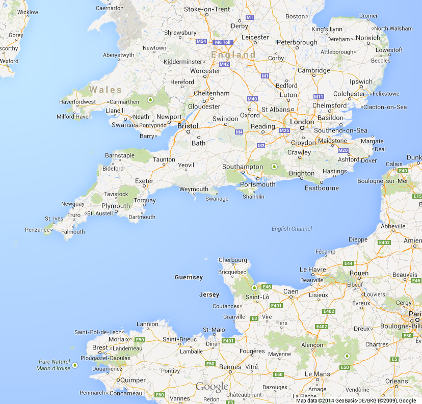

# About the author

I live in [Jersey (the largest of the Channel Islands)](https://goo.gl/maps/1O5ww) and work as an independent consultant, helping teams to build better software. I'm an [award-winning speaker](http://www.codingthearchitecture.com/2013/05/17/saturn_2013.html) and I provide consulting/training to software teams around the world. My client list spans over 20 countries and includes organisations ranging from small technology startups through to global household names. I still code too.

You can find my website at [http://www.simonbrown.je](http://www.simonbrown.je) and I can be found on Twitter at [@simonbrown](https://twitter.com/simonbrown).