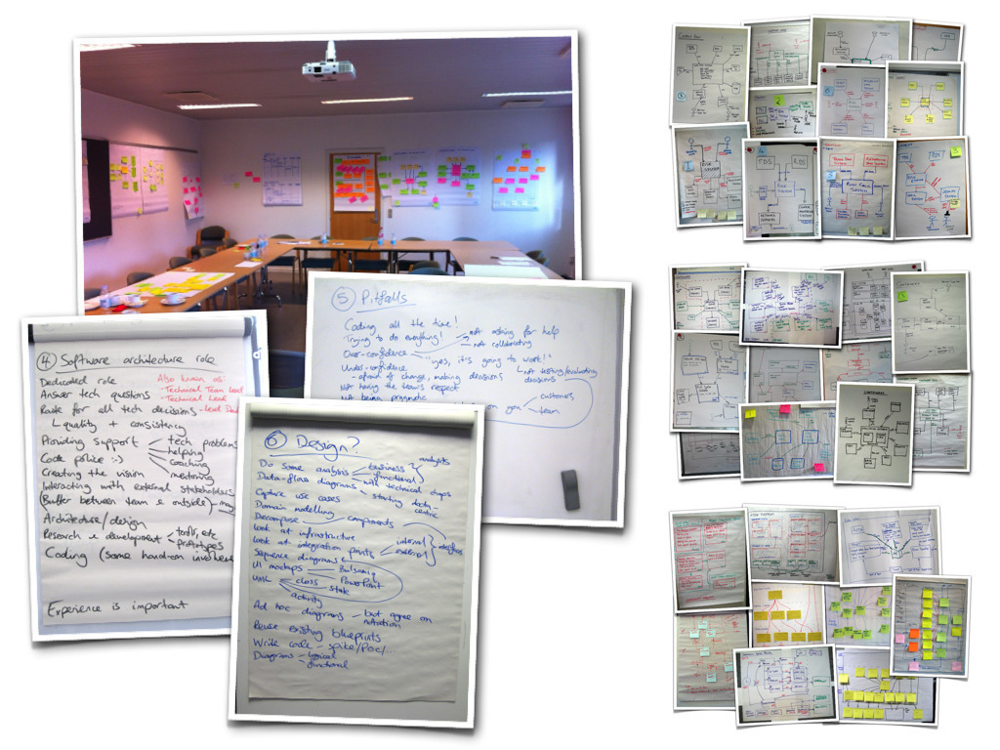

# Software architecture training

I provide one and two-day training courses that are practical and pragmatic guides to lightweight software architecture, covering the same content you'll find in this book. You'll learn:

 - The essence of software architecture.
 - Why the software architecture role should include coding, coaching and collaboration.
 - The things that you *really* need to think about before coding.
 - How to visualise your software architecture using simple sketches.
 - A lightweight approach to documenting your software.
 - Why there is *no* conflict between agile and architecture.
 - What "just enough" up front design means.
 - How to identify risks with risk-storming.

I'll teach you about software architecture, technical leadership and the balance with agility. The video of my [Software Architecture & the balance with agility](http://vimeo.com/user22258446/review/79382531/91467930a4) talk from the Software Architect 2013 conference provides a good overview of what the course is all about. My courses and workshops have been run in more than twenty countries across Europe, the Middle East and the United States.

There are a number of course configurations and delivery options, which include private courses at your own offices. See [http://www.codingthearchitecture.com/training/](http://www.codingthearchitecture.com/training/) or e-mail [simon.brown@codingthearchitecture.com](mailto:simon.brown@codingthearchitecture.com) for further details.